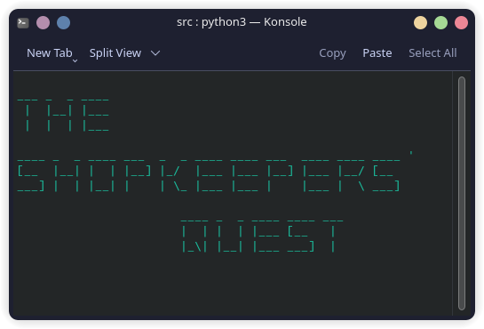

# The Shopkeeper's Quest

The Shopkeeper's Quest is a text-based adventure game written in Python. It is licensed MIT and it is free for anyone to play and modify. 
Built using the SHM Engine 1.2 

Inspired by:

- [Colossal Cave Adventure](https://en.wikipedia.org/wiki/Colossal_Cave_Adventure)
- [King's Quest](https://en.wikipedia.org/wiki/King%27s_Quest_I)
- [Henry Stickmin](https://simple.wikipedia.org/wiki/The_Henry_Stickmin_Collection)
- [Minecraft: Story Mode](https://en.wikipedia.org/wiki/Minecraft%3A_Story_Mode)
- [RTX Morshu: The Game](https://koshkamatew.itch.io/morshugame-demo)

## Usage and Requirements

- Requires Python 3.11+.
- Requires ncurses, ususally pre-installed on *nix systems. For Windows, you must install [windows-curses](https://pypi.org/project/windows-curses/).
- To run the game, you should execute the `src/` as a module. e.g. `python -m src` in the parent directory. This varies for different systems.
